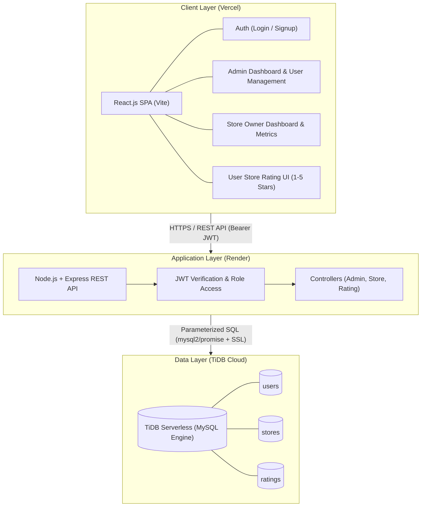
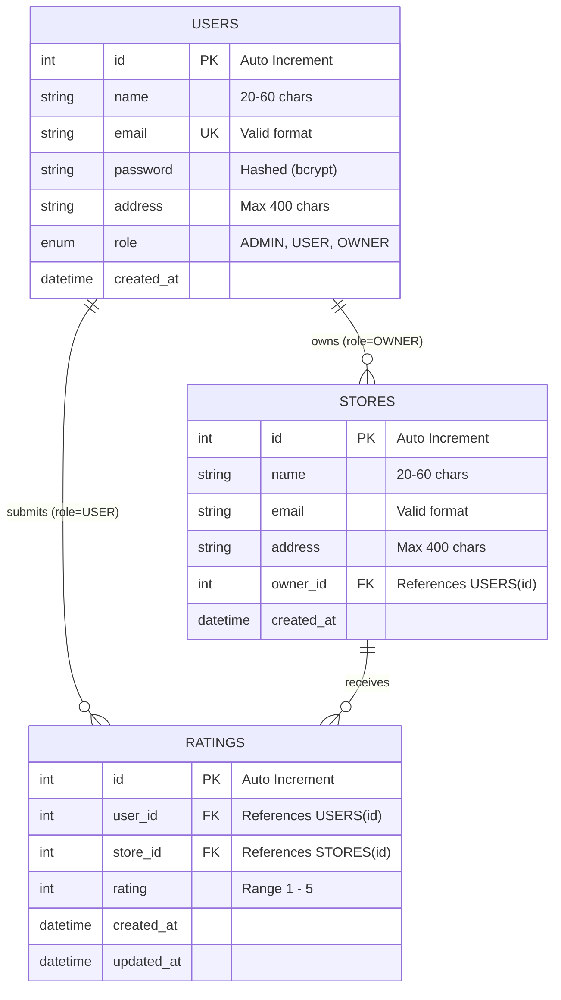

# Store Rating Web Application

A full-stack web application with role-based access control (System Administrator, Normal User, Store Owner) where users can discover and rate stores, administrators manage users and listings, and store owners analyze performance metrics[cite: 1, 5].

---

## 🚀 Live Demo
- **Frontend App:** [https://store-rating-app-swart-nine.vercel.app](https://store-rating-app-swart-nine.vercel.app)
- **Backend API:** [https://store-rating-app-1-hnw3.onrender.com/api](https://store-rating-app-1-hnw3.onrender.com/api)

---

## 🛠 Tech Stack
- **Frontend:** React.js (Vite), React Router v6, Axios, Lucide Icons, Modern CSS[cite: 1, 3]
- **Backend:** Node.js, Express.js (REST API, JWT Authentication, bcryptjs)[cite: 1, 3]
- **Database:** TiDB Cloud Serverless (MySQL Compatible) via TLS/SSL Connection Pool[cite: 1, 3]
- **Hosting:** Vercel (Frontend SPA), Render (Backend Web Service)

---

## 📐 Architecture & System Design

### 1. 3-Tier System Architecture

### 2. Entity-Relationship Diagram (ERD)

---

## 🔑 Pre-Configured Demo Credentials

| Role | Email | Password | Permissions |
| :--- | :--- | :--- | :--- |
| **System Administrator** | `admin@storerating.com` | `Admin@12345` | Manage users, stores, global stats, sorting/filtering[cite: 1, 5] |
| **Store Owner** | `owner@storerating.com` | `Owner@12345` | View store average rating, list of raters[cite: 1, 5] |
| **Normal User** | *Register via /signup* | *Min 8-16 chars* | Browse stores, submit & modify 1-5 star ratings[cite: 1, 5] |

---

## ✨ Features & Constraints
- **Role-Based Routing:** Dedicated UI views and backend middleware protection per role.
- **Single-Rating Constraint:** Enforced via `UNIQUE KEY (user_id, store_id)` so raters can only submit one rating per store and subsequently edit it.
